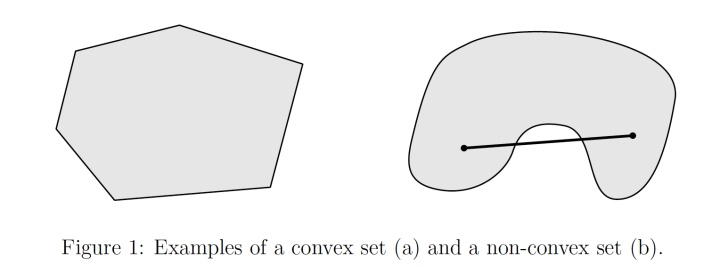
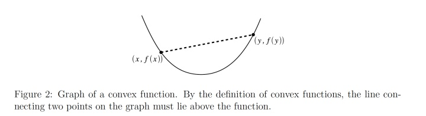

## 凸二次规划（convex quadratic programming）

### 凸集（convex set）

几何意义：若集合中任意两点间的线段永远在该集合中，该集合称为凸集。如下图中左图为凸集。

定义：指对任意 $x,y\in C,\ \Theta \in R, \ 0\leq \Theta \leq 1$，都有： $\Theta x + (1-\Theta)y \in C$ 的集合。

常见凸集有：

* n 维实数空间
* 一些范数约束形式的集合
* 仿射子空间
* 凸集的交集
* n 维半正定矩阵集

### 凸函数（convex function）

几何意义：函数上任意两点 $x_1,x_2$ 的连线上的值都大于对应自变量区间 $(x_1,x_2)$ 内的函数值。

定义：定义域为凸集 $D(f)$，且对于任意 $x,y \in D(f),\ \Theta \in R,\ 0\leq \Theta \leq 1$，有：
$$
f(\Theta x + (1-\Theta)y) \leq \Theta f(x) + (1-\Theta)f(y)
$$
常见凸函数：

* 指数函数组
* 非负对数函数
* 仿射函数 ？
* 二次函数
* 常见的范数函数
* 凸函数非负加权的和

### 凸优化问题

研究定义于**凸集**中的**凸函数**的**最小化**问题：
$$
\min f(x),\\ \mathrm{s.t.}\quad x\in C
$$
其中， $f$ 为凸函数，$C$ 为凸集，$x$ 是优化变量。也常用下式表达：
$$
\min f(x),\\ 
\begin{align}
\mathrm{s.t.}\quad &g_i(x) \leq 0, \quad i=1,2,\cdots,m \\
&h_j(x)=0, \quad i=1,2,\cdots,n
\end{align}
$$
其中， $f$ 为凸函数，$g_i$ 为凸函数，$h_i$ 为仿射函数，$x$ 是优化变量。

常见凸优化问题：

* 线性规划
* 二次规划
* 二次约束的二次规划
* 半正定规划

### 二次规划（Quadratic Programming）

简称 QP，包括凸二次规划和非凸二次规划。此类问题中，目标函数是变量的二次函数，约束条件是变量的线性不等式：
$$
\min_x \frac{1}{2}x^TQx+c^Tx \\
\mathrm{s.t.}\quad Ax \leq b
$$
其中 $x\in R^d$，$Q\in  R^{d\times d}$ 为实对称矩阵，$A\in R^{m\times d}$ 为实对称矩阵，$b\in R^m$ 和 $c\in R^d$ 为实向量，$Ax\leq b$ 的每一行对应一个约束。

通常一个优化问题可以从两个角度来考虑，即**主问题**（primal problem）和**对偶问题**（dual problem）。在约束最优化问题中，常常利用拉格朗日对偶性将原始问题（主问题）转换成对偶问题，通过解对偶问题来得到原始问题的解。这样做是因为对偶问题的复杂度往往低于主问题。