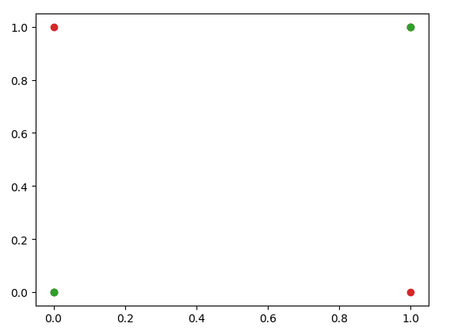

# Perceptron

## 特征

* 二分类
* 线性分类器

## 前置知识

符号函数 $\mathrm{sign}(x):$
$$
\mathrm{sign}(x)=\begin{cases}
+1, & x\geqslant 0\\
-1, & x<0
\end{cases}
$$

## 模型

输入空间：$\cal{X}\subseteq \bf{R}^n$

输出空间：$\cal{Y}=\{-1,+1\}$

输入：$x\in \cal{X}$ 表示特征向量；

输出：$y\in \cal{Y}$ 表示实例类别。

决策函数：$y=f(x)=\mathrm{sign}(w\cdot x+b)$

## 策略

分类结果判断依据：
$$
y_i(w\cdot x+b)=\begin{cases}
>0 & \text{分类正确} \\
\leq0 & \text{分类错误}
\end{cases}
$$
假设误分类点集合为 $M$，则所有误分类点到超平面 $S$ 的总距离：
$$
-\frac{1}{||w||}\sum_{x_i\in M}{y_i(w\cdot x_i+b)}
$$
损失函数 = 不考虑  $\frac{1}{||w||}$ 的误分类点到超平面 $S$ 的总距离：
$$
L(w,b)=-\sum_{x_i\in M}{y_i(w\cdot x_i+b)}
$$
给定训练数据集 $T$，损失函数 $L(w,b)$ 是 $w$ 和 $b$ 的连续可导函数。

## 算法

### 原始形式

感知机学习问题转为求解损失函数的优化问题，方法采用随机梯度下降法（SGD）。

目的：使以下损失函数极小化
$$
\min_{w,b} L(w,b) = -\sum_{x_i \in M} y_i(w\cdot x_i + b)
$$
其中 $M$ 为误分类点的集合。

**算法**：

输入：给定一个训练集 $T=\{(x_1,y_1),\cdots,(x_N,y_N)\}$，其中 $x_i\in\mathcal{X}=\R^n$，$y_i\in\mathcal{Y}=\{-1,1\}$，$i=1,\cdots,N$；学习率 $\eta(0<\eta\leq 1)$

输出：$w,b$；感知机模型 $f(x)=\mathrm{sign}(w\cdot x+b)$

1. 选取初值 $w_0,b_0$
2. 在训练集中选取数据 $(x_i,y_i)$
3. 若 $y_i(w\cdot x+b) \leq 0$
   1. $w:= w+\eta y_i x_i$
   2. $b:= b+\eta y_i$
4. 转至 2，直到训练集中没有误分类点

### 对偶形式


## 习题

1.不能表示异或

| 输入 | 0    | 1    |
| ---- | ---- | ---- |
| 0    | 0    | 1    |
| 1    | 1    | 0    |

```python
x=[[0,0],[0,1],[1,0],[1,1]]
y=[0,1,1,0]
x1 = [[0,0],[1,1]] # 0
x2 = [[0,1],[1,0]] # 1
plt.plot(x1,'o')
plt.plot(x2,'o')
plt.show()
```



由图可知，线性不可分