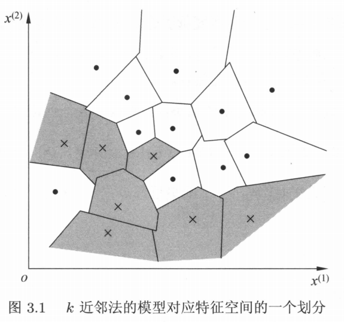
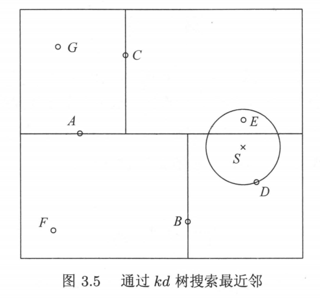

# k-nearest neighbors

[TOC]

## 特征

* 分类 + 回归
* 线性分类器
* 无显式学习过程

## 前置知识

* 距离度量

  $x_i, x_j$ 为特征向量，$\cal{X}$ 是特征空间，有 $x_i,x_j \in \cal{X} \subseteq{\bf{R}^n}$，$x_i=(x_i^{(1)},x_i^{(2)},\cdots,x_i^{(n)})^T$，$x_i,x_j$ 的 $L_p$ 距离定义为：
  $$
  L_p(x_i,x_j)=(\sum_{l=1}^{n}{|x_i^{(l)}-x_j^{(l)}|^p})^{\frac{1}{p}}
  $$
  当 $p=1$ 时，称为曼哈顿距离 （Manhattan distance），即：
  $$
  L_1(x_i,x_j)=\sum_{l=1}^{n}{|x_i^{(l)}-x_j^{(l)}|}
  $$
  当 $p=2$ 时，称为欧式距离 （Euclidean distance），即：
  $$
  L_2(x_i,x_j)=(\sum_{l=1}^{n}{|x_i^{(l)}-x_j^{(l)}|^2})^{\frac{1}{2}}
  $$
  当 $p=\infin$ 时，为某一维特征距离的最大值：
  $$
  L_{\infin}(x_i,x_j)=\max_{l}{|x_i^{(l)}-x_j^{(l)}|}
  $$

* 指示函数

$$
I(statement)=\begin{cases}
1 & \text{statement is true} \\
0 & \text{statement is false}
\end{cases}
$$

## 模型

输入：$x_i \in \cal{X} \subseteq{\bf{R}^n}$ 为实例的特征向量；

输出：$y_i \in \cal{Y} = {c_1, c_2,\cdots,c_K}$ 为实例的类别，$i=1,2,\cdots,N$。

决策：

1. 根据给定的距离度量，在训练集 $T$ 中找出与 $x$ 最邻近的 $k$ 个点，涵盖这 $k$ 个点的 $x$ 的邻域记作 $N_k(x)$；
2. 在 $N_k(x)$ 中根据分类决策规则决定 $x$ 的类别。

多数表决（majority voting rule）的决策函数：
$$
y={\mathrm{arg}}\ \max_{c_i}\ \sum_{x_i \in N_k(x)}{I(y_i=c_i)}, \quad i=1,2,\cdots,N;j=1,2,\cdots,K
$$
特殊情况：

1. $k=1$ 也叫最近邻算法，取距离 $x$ 最近的点的类作为 $x$ 的类；
2. $k=N$ 取训练集中样例最多的类作为 $x$ 的类。

## 策略

如果损失为 0 - 1 损失函数，则误分类的概率为：
$$
P(Y\neq f(X))=1-P(Y=f(X))
$$
给定实例 $x\in \cal{X}$ 和其最近邻的 $k$ 个训练实例点构成集合 $N_k(x)$，如果涵盖 $N_k(x)$ 的区域的类别是 $c_j$，则误分类率为：
$$
\frac{1}{k}\sum_{x_i \in N_k(x)}{I(y_i\neq c_j)=1-\frac{1}{k}\sum_{x_i \in N_k(x)}I(y_i=c_i)}
$$

## 算法

### 线性扫描法

略

### kd 树

* 构造

  输入： $k$ 维空间数据集 $T=\{x_1,x_2,\cdots,x_N\}$，其中 $x_i=(x_i^{(1)},x_i^{(2)},\cdots,x_i^{(k)})^T$，$i=1,2,\cdots,N$；

  输出：kd 树。

  算法：

  1. 开始：构造根节点，包含对应于 $T$ 的 $k$ 维空间的超矩形区域。由根节点生成深度为 1 的左、右子节点，左子节点对应 $x^{(1)}$ 小于切分点，右子节点对应 $x^{(1)}$ 大于切分点，将落在切分超平面上的实例点保存在根节点。
  2. 重复：对深度为 $j$ 的节点，以该节点区域中所有实例的 $x^{(l)}$ 坐标的中位数为切分点，$l=j\mod k+1$，用一垂直于该坐标轴且经过切分点的超平面将该节点对应的超矩形区域切分为两个子区域，生成深度为 $j+1$ 的左右子节点，左子节点对应 $x^{(l)}$ 小于切分点，右子节点对应 $x^{(l)}$ 大于切分点，将落在切分超平面上的实例点保存在该节点。
  3. 一直重复到两个子区域没有实例存在时停止，从而形成 kd 树的区域划分。

* 搜索

  

  输入：已构造的 kd 树，目标点 $x$；

  输出：$x$ 的最近邻。

  算法：

  1. 根据比较不同维度坐标大小，若当前维度小于该节点，访问该节点左节点，反之访问右节点；递归地向下访问 $kd$ 树，直到子节点为叶节点为止，以此节点为 *当前最近点* （记为 A，目标点记为 D）；

  2. 递归地向上回退（记为 B），在每个节点进行以下操作：

     2.1 若该节点保存的实例点比当前最近点 A 间距离目标点更近，则以该实例点为当前最近点，A = B；

     2.2 检查 B 的另一子节点（记为 C）对应的区域是否有比 A 更近的点。即 C 对应的区域是否 *与* 以 D 为中心，distance(D, A)为半径的超球体区域相交；若相交，则可能存在距离 D 更近的点，B = C，并回到 2.1；反之，不可能存在距离 D 更近的点，回到 2 。

  复杂度：当 $N \gg k$，即实例数远大于空间维度时，平均计算复杂度为 $O(\log N)$；当两者接近时，接近于线性扫描。

* [代码实现参考][1]

[1]: https://docs.scipy.org/doc/scipy/reference/generated/scipy.spatial.KDTree.html	"kd tree 实现参考"

