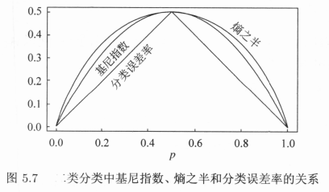

# decision tree

[TOC]

## 特征

* 分类与回归
* if-then 的集合
* 递归
* 次最优（sub-optimal）

## 前置知识

### 特征选择

特征选择在于选取对训练数据具有分类能力的特征，若选择某一特征进行分类的结果与随机分类的结果没有很大差别，则称这个特征是没有分类能力的。经验上去掉这样的特征对决策树学习的精度影响不大。通常特征选择的准则是信息增益（information gain）或信息增益比。

熵和条件熵

熵（entropy）：表示随机变量不确定性的度量，熵越大，随机变量的不确定性就越大。

设 $X$ 是一个取有限个值（记为 $n$）的离散随机变量，其概率分布为：
$$
P(X=x_i)=p_i,\quad i=1,2,\cdots,n\\
x\in\{x_1,x_2,\cdots,x_n\}
$$
则随机变量 $X$ 的熵的定义为
$$
H(X)=-\sum_{i=1}^{n}{p_i\log{p_i}},\quad 0\leq H(X)\leq \log n
$$
上式中，若 $p_i=0$，则定义 $0\log 0=0$。若上式中的对数以 2 为底或以 e 为底（自然对数），则熵的单位分别为比特（bit）或纳特（nat）。易知熵只依赖于 $X$ 的分布，与 $X$ 的取值无关，故也可记作 $H(p)$。

条件熵（conditional entropy） $H(Y|X)$ 表示在已知随机变量 $X$ 的条件下随机变量 $Y$ 的不确定性。
$$
\begin{aligned}
H(Y|X)&=\sum_{i=1}^{n}P(X=x_i)H(Y|X=x_i)\\
&=-\sum_{x}{p(x)H(Y|X=x)}\\
&=-\sum_{x}{p(x)\sum_{y}{p(y|x)\log{p(y|x)}}}\\
&=-\sum_{x}\sum_{y}p(x,y)\log{p(y|x)}\\
&=-\sum_{x}\sum_{y}p(x,y)\log{\frac{p(x,y)}{p(x)}}\\
&=-\sum_{x}\sum_{y}p(x,y)\log{p(x,y)}+\sum_{x}\sum_{y}p(x,y)\log{p(x)}\\
&=-H(X,Y)+\sum_{x}p(x)\log{p(x)}\\
&=H(X,Y)-H(X)\\
\end{aligned}
$$
熵和条件熵若由极大似然估计得到，又分别称为经验熵（empirical entropy）和经验条件熵（empirical conditional entropy）。

**信息增益**

信息增益：特征 $A$ 对训练数据集 $D$ 的信息增益 $g(D,A)$ 定义为集合 $D$ 的经验熵 $H(D)$ 与给定特征 $A$ 的条件下 $D$ 的经验条件熵 $H(D|A)$ 之差，即：
$$
g(D,A)=H(D)-H(D|A)
$$
该值也称为互信息（mutual information），表示由于特征 $A$ 而使得对数据集 $D$ 的分类的不确定减少的程度。易知信息增益大的特征具有更强的分类能力。

根据信息增益准则的特征选择方法：对训练数据集 $D$，计算其每个特征的信息增益，选择信息增益最大的（部分）特征。

**信息增益比**

以信息增益作为选取特征的指标存在偏向于选择（在相同分布下）取值较多的特征的问题。使用信息增益比（information gain ratio）可以校正这一问题。

定义：特征 $A$ 对训练数据集 $D$ 的信息增益比 $g_R(D,A)$ 定义为其信息增益 $g(D,A)$ 与训练数据集 $D$ 关于特征 $A$ 的值的熵 $H_A(D)$ 之比，即：
$$
g_R(D,A)=\frac{g(D,A)}{H_A(D)}\\
H_A(D)=\sum_{i=1}^{n}\frac{|D_i|}{|D|}\log_2\frac{|D_i|}{|D|}
$$

## 模型

给定数据集
$$
D=\{(x_1,y_1),(x_2,y_2),\cdots,(x_N,y_N)\}
$$
其中，$x_i=(x_i^{(1)},x_i^{(2)},\cdots,x_i^{(n)})^T$ 为输入实例（特征向量），$n$ 为特征个数，$y_i\in\{1,2,\cdots,K\},i=1,2,\cdots,N$ 为类标记，$N$ 为样本容量。决策树的将构建一个决策树模型，使其能够对实例正确分类。

## 策略

设树 $T$ 的叶节点个数为 $|T|$，$t$ 是某一叶节点，该叶节点有 $N_t$ 个样本点；第 $t$ 个叶节点中第 $k$ 类的样本有 $N_{tk}$ 个，$t=1,2,\cdots,N_{t};k=1,2,\cdots,K$；$H_{t}(T)$ 为叶节点 $t$ 上的经验熵，$\alpha \geq 0$ 为参数，则决策树学习的损失函数可以定义为：
$$
C_{\alpha}(T)=\sum_{t=1}^{|T|}N_tH_t(T)+\alpha |T|
$$
其中经验熵为：
$$
H_t(T)=-\sum_k \frac{N_{tk}}{N_t}\log{\frac{N_{tk}}{N_t}}
$$
记$\sum_{t=1}^{|T|}N_tH_t(T)$ 为 $C(T)$，有：
$$
C(T)=\sum_{t=1}^{|T|}N_tH_t(T)=-\sum_{t=1}^{|T|}\sum_{k=1}^{K}N_{tk}\log\frac{N_{tk}}{N_t}
$$
这时有：
$$
C_{\alpha}(T)=C(T)+\alpha |T|
$$
其中 $C(T)$ 表示模型对训练数据的预测误差，$|T|$ 表示模型复杂度；较大的 $\alpha$ 促使选择简单、对训练数据的拟合度低的模型，较小的 $\alpha$ 促使选择复杂、对训练数据的拟合度高的模型。

## 算法

ID3、C4.5 适用于分类。

### 1.信息增益

输入：训练集 $D$ 和特征 A；

输出：特征 $A$ 对数据集 $D$ 的信息增益 $g(D,A)$。

算法：

1. 计算数据集 $D$ 的经验熵 $H(D)$：
   $$
   \begin{aligned}
   H(D)&=-\sum_{k=1}^{K}\frac{|C_k|}{|D|}\log_2\frac{|C_k|}{|D|}\\
   &=-\sum_{k=1}^{K}p(y_k)\log_2{p(y_k)}\\
   y\in\{&y_1,y_2,\cdots.y_K\},\quad \sum_{k=1}^{K}{|C_k|}=|D|
   \end{aligned}
   $$

2. 计算特征 $A$ 对数据集 $D$ 的经验条件熵 $H(D|A)$：
   $$
   \begin{aligned}
   H(D|A)&=\sum_{a}{p(a)H(D|A=a)}\\
   &=\sum_{i=1}^{n}\frac{|D_i|}{|D|}H(D|A=a)\\
   &=\sum_{i=1}^{n}\frac{|D_i|}{|D|}\sum_{d}{p(d|a)\log{p(d|a)}}\\
   &=\sum_{i=1}^{n}\frac{|D_i|}{|D|}\sum_{k=1}^{K}\frac{|D_{ik}|}{|D_i|}\log_2\frac{|D_{ik}|}{|D_i|}
   \end{aligned}
   $$
   注：数据集 $D$ 可以根据标签 y 的取值（离散）分为 K 类，每一类为子集 $D_k,1\leq k\leq K$，该子集样本数量为 $|D_i|$；同时可以根据特征 A 的取值（离散）分为 n 类，每一类为子集 $D_i,1\leq i\leq n$，该子集样本数量为 $|D_i|$。

3. 计算信息增益：
   $$
   g(D,A)=H(D)-H(D|A)
   $$

### 2.决策树生成：ID3 算法

输入：训练集 $D$，特征集 $A$ 阈值 $\epsilon$；

输出：决策树 $T$。

算法：

1. 如果 $D$ 属于同一类 $C_k$，$T$ 为单节点树，类 $C_k$ 作为该节点的类标记，返回 $T$；
2. 如果 $A$ 是空集，置 $T$ 为单节点树，实例数最多的类作为该节点类标记，返回 $T$；
3. 否则，计算 $A$ 中各特征对 $D$ 的信息增益 $g$，选择信息增益最大的特征 $A_g$；
4. 如果 $A_g$ 的信息增益小于 $\epsilon$，$T$ 为单节点树，$D$ 中实例数最大的类 $C_k$ 作为类标记，返回 $T$；
5. 否则根据 $A_g$ 的每一可能值 $a_i$，将 $D$ 划分为若干非空子集 $D_i$，将 $|D_i|$ 最大的类作为标记，构建子节点；由节点及其子节点构成树 $T$，返回 $T$；
6. 对每一子节点，即 $D_i$ 训练集，以 $A-A_g$ 为特征集，递归调用步骤 $1\sim5$，得到  $T_i$，返回 $T_i$；

由于 ID3 算法只有树的生成，所以容易过拟合。

### 3.决策树生成：C4.5算法

采用信息增益比来选择特征。

输入：训练集 $D$，特征集 $A$ 阈值 $\epsilon$；

输出：决策树 $T$。

算法：

1. 如果 $D$ 属于同一类 $C_k$，$T$ 为单节点树，类 $C_k$ 作为该节点的类标记，返回 $T$；
2. 如果 $A$ 是空集，置 $T$ 为单节点树，实例数最多的类作为该节点类标记，返回 $T$；
3. 否则，计算 $A$ 中各特征对 $D$ 的信息增益 $g_R$，选择信息增益最大的特征 $A_g$；
4. 如果 $A_g$ 的信息增益小于 $\epsilon$，$T$ 为单节点树，$D$ 中实例数最大的类 $C_k$ 作为类标记，返回 $T$；
5. 否则根据 $A_g$ 的每一可能值 $a_i$，将 $D$ 划分为若干非空子集 $D_i$，将 $|D_i|$ 最大的类作为标记，构建子节点；由节点及其子节点构成树 $T$，返回 $T$；
6. 对每一子节点，即 $D_i$ 训练集，以 $A-A_g$ 为特征集，递归调用步骤 $1\sim5$，得到  $T_i$，返回 $T_i$；

### 4.树的剪枝（pruning）算法

输入：生成算法产生的整个树 $T$，参数 $\alpha$；

输出：修剪后的子树 $T_{\alpha}$。

算法：

1. 计算每个节点的经验熵；

2. 递归地从树的叶节点向上回缩；

3. 设回缩前的树为 $T_B$，回缩后为 $T_A$，其对应的损失函数分别为 $C_{\alpha (T_B)}$ 与 $C_{\alpha (T_A)}$，若：
   $$
   C_{\alpha (T_A)} \leq C_{\alpha (T_B)}
   $$
   则进行剪枝，即将父节点变为新的叶节点。

4.  重复 $2\sim3$，直到不能继续时停止，得到损失函数最小的子树 $T_{\alpha}$。

## CART 分类与回归树 （classification and regression tree）

CART 由特征选择、树的生成及剪枝组成，适用于分类与回归。将用于分类与回归的树统称为决策树。

### 回归树的生成

#### 模型

输入：训练数据集 $D$：
$$
D=\{(x_1,y_1),(x_2,y_2),\cdots,(x_N,y_N)\}
$$
输出：回归树

#### 策略

一颗回归树对应输入空间（特征）的一个划分和一个输出值。设有 $M$ 颗回归树，输入空间被划分为$R_1,R_2,\cdots,R_M$ 共 $M$ 个单元，并在每个单元 $R_m$ 上各有一个固定的输出值 $c_m$。$\big(I(x\in R_1),I(x\in R_2),\cdots,I(x\in R_M)\big)^T$ 是 one-hot 向量。则回归树模型可表示为：
$$
f(x)=\sum_{m=1}^{M}c_m I(x\in R_m)\\
f_{x\in R_m}(x)=c_m
$$
划分输入空间，构造回归树的方法为：考虑选择第 $j$ 个变量 $x^{(j)}$ 和它的阈值 $s$ 作为切分变量（splitting variable）和切分点（splitting point），则可划分为 $R_1,R_2$ 两个区域：
$$
R_1(j,s)=\{x|x^{(j)}\leq s\},\quad R_2(j,s)=\{x|x^{(j)}> s\}
$$
损失函数可定义为：
$$
L(j,s,c_1,c_2)=\sum_{x\in R_1(j,s)}(y-c_1)^2+\sum_{x\in R_2(j,s)}(y-c_2)^2
$$

用平方误差最小的准则求解时，易知最优值为均值，即：
$$
\hat{c_1}=\mathrm{ave}(y_i|x_i\in R_1(j,s)),\quad\hat{c_2}=\mathrm{ave}(y_i|x_i\in R_2(j,s))
$$

#### 算法

最小二乘回归树生成算法

输入：训练数据 $D$；

输出：回归树 $f(x)$。

算法：在训练数据集的输入空间中，递归地将每个区域划分为**两**个子区域并决定每个子区域上的输出值，构建二叉决策树。

1. 选择最优切分变量 $j$ 与 切分点 $s$ ：遍历变量 $j$，对每一 $j$ 扫描切分点 $s$，选择使 $L(j,s,c_1,c_2)$ 达到最小值的对 $(j,s)$，即：
   $$
   \min_{j,s}\left[\min_{c_1}\sum_{x\in R_1(j,s)}(y-c_1)^2+\min_{c_2}\sum_{x\in R_2(j,s)}(y-c_2)^2\right]
   $$
   其中
   $$
   R_1(j,s)=\{x|x^{(j)}\leq s\},\quad R_2(j,s)=\{x|x^{(j)}> s\}\\
   \hat{c_m}=\mathrm{ave}(y_i|x_i\in R_m(j,s)),\quad x\in R_m,\quad m=1,2
   $$

2. 继续对两个子区域调用步骤 $1$，直至满足停止条件，即分成 $M$ 个区域 $R_1,R_2,\cdots,R_M$，生成决策树：
   $$
   f(x)=\sum_{m=1}^{M}c_m I(x\in R_m)
   $$

### 分类树的生成

分类树用基尼指数选择最优特征，同时决定该特征的最优二值切分点。

#### 前置知识

**1.基尼指数**

分类问题中假设有 $K$ 个类，样本点属于第 $k$ 类的概率为 $p_k$，则概率分布的基尼指数为：
$$
\mathrm{Gini}(p)=\sum_{k=1}^{K}p_k(1-p_k)=1-\sum_{k=1}^{K}{p_k^2}\\
\mathrm{Gini}(D)=1-\sum_{k=1}^{K}\left({\frac{|C_k|}{|D|}}\right)^2
$$
该指数表示集合分布的不确定性，基尼指数数值越大，样本集合的不确定性也就越大。

对二分类问题，若样本点属于第 1 个类的概率为 $p$，则概率分布的基尼指数为：
$$
\mathrm{Gini}(p)=2p(1-p)
$$
若样本集合 $D$ 根据特征 $A$ 是否取某一值 $a$ 被分割成 $D_1,D_2$ 两部分，即
$$
D_1=\{(x,y)\in D|A(x)=a\},\quad D_2=D-D_1
$$
则在特征 $A$ 的条件下，集合 $D$ 的基尼指数定义为：
$$
\mathrm{Gini}(D,A)=\frac{|D_1|}{|D|}\mathrm{Gini}(D_1)+\frac{|D_2|}{|D|}\mathrm{Gini}(D_2)
$$

#### 模型

输入：训练数据集 $D$ 及停止计算的条件
$$
D=\{(x_1,y_1),(x_2,y_2),\cdots,(x_N,y_N)\}
$$
输出：决策树

#### 策略

最小化基尼指数

#### 算法

输入：训练数据集 $D$，停止计算的条件（节点中样本个数阈值或样本集的基尼指数阈值或满足同一类别）；

输出：CART 决策树。

算法：根据训练数据集，从根节点开始，递归地对每个节点进行以下操作，构建二叉决策树：

1. 设节点的训练数据集为 $D$，遍历其每一特征 $A$ 以及该特征的每一可能取值 $a$，根据样本点对 $A=a$ 的测试为 “是” 或 “否” 将 $D$ 分割为 $D_1$ 和 $D_2$ 两部分，计算 $\mathrm{Gini}(D,A)$；
2. 取基尼指数最小的特征及其对应的切分点作为最优特征与最优切分点，并以此生成两个子节点，将训练数据集依次分配到子节点中；
3. 对两个子节点递归调用 $1\sim2$，直到满足停止条件。
4. 生成 CART 决策树。

### CART 的剪枝

#### 模型

输入：决策树

输出：修剪后的决策树

#### 策略

对一固定的 $\alpha$ 一定存在使损失函数 $C_{\alpha}(T)=C(T)+\alpha |T|$ 最小的子树 $T_{\alpha}$，且可证该最小子树唯一，为最优。$\alpha$ 越大，最优子树 $T_{\alpha}$ 偏小；反之偏大。当 $\alpha = 0$ 时，整体树最优。当 $\alpha = +\infin$ 时，只有根节点，根节点组成的单节点树最优。

记未修剪的决策树为 $T_0$，对其任意内部节点 $t$，以 $t$ 为单节点树的损失函数为：
$$
C_{\alpha}(t)=C(t)+\alpha|t|=C(t)+\alpha
$$
以 $t$ 为根节点的子树 $T_t$ 的损失函数为：
$$
C_{\alpha}(T_t)=C(T_t)+\alpha|T_t|
$$
当 $\alpha=0$ 时，由于损失函数只计算根节点，子树的根节点已经分好类，故熵小于未分类的根节点，有不等式：
$$
C_{\alpha}(T_t)<C_{\alpha}(t)
$$
当 $\alpha=\frac{C(t)-C(T_t)}{|T_t|-1}$时，左右两式相等，而 $t$ 的节点少，故 $t$ 比 $T_t$ 更可取，对 $T_t$ 进行剪枝。为此对 $T_0$ 中每一节点 $t$ 计算
$$
g(t)=\frac{C(t)-C(T_t)}{|T_t|-1}
$$
该值表示剪枝后整体损失函数减少的程度，当 $g(t)$ 最小时，从 $T_0$ 中减去 $T_t$，将得到的子树作为 $T_1$，同时将最小的 $g(t)$ 设为 $\alpha_1$，$T_1$ 为区间 $[\alpha_1,\alpha_2)$ 的最优子树。重复直到得到根节点，可得到一系列区间，算上最初的 $T_0,\alpha_0=0$，有 $[\alpha_i,\alpha_{i+1}),\ i=0,1,\cdots,n$ 及其对应的最优子树序列 $\{T_0,T_1,\cdots,T_n\}$，序列中的子树是嵌套的。

再利用验证集验证各颗子树的平方误差或基尼指数，最小的决策树被认为是最优的决策树。

#### 算法

输入：CART 算法生成的决策树 $T_0$；

输出：最优决策树 $T_{\alpha}$。

算法：

1. 设 $k=0,T=T_0$；

2. 设 $\alpha=+\infin$ ；

3. 自下而上地对各内部节点 $t$ 计算 $C(T_t)$，$|T_t|$ 以及
   $$
   g(t)=\frac{C(t)-C(T_t)}{|T_t|-1}\\
   \alpha=\min(\alpha,g(t))
   $$
   其中，$T_t$ 表示以 $t$ 为根节点的子树，$C(T_t)$ 是对训练数据的预测误差，$|T_t|$ 是 $T_t$的叶结点个数。

4. 对 $g(t)=\alpha$ 的内部节点 $t$  进行剪枝，并对叶节点 $t$ 以多数表决法决定其类别，得到树 $T$；

5. 设 $k=k+1,\ \alpha_k=\alpha,\ T_k=T$；

6. 若 $T_k$ 不是由根节点及两个叶节点构成的树，则回到步骤 $2$；否则令 $T_k=T_n$。

7. 利用验证集在子树序列 $T_0,T_1,\cdots,T_n$ 中选取最优子树 $T_{\alpha}$

