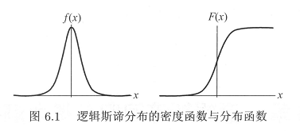
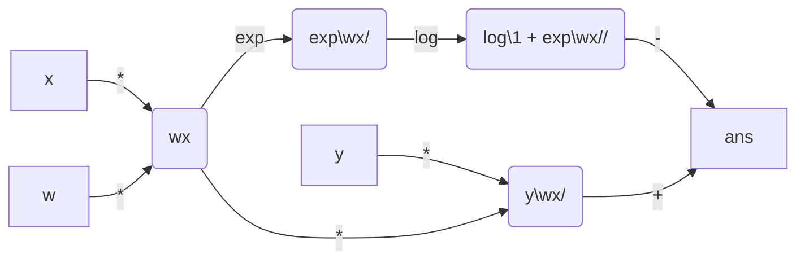

# Logistic regression

## 特征

* 分类

## 前置知识

### 逻辑斯谛分布（logistic distribution）

设 $X$ 是连续随机变量，$X$ 有以下分布函数与概率密度函数：
$$
F(x)=P(X\leq x)=\frac{1}{1+e^{-(x-\mu)/\gamma}}\\
f(x)=F'(x)=\frac{1+e^{-(x-\mu)/\gamma}}{\mu(1+e^{-(x-\mu)/\gamma})}
$$
其中，$\mu$ 为位置参数，$\gamma > 0$ 为形状参数。分布函数图形为 $S$ 形曲线（sigmoid curve）。该曲线以点 $(\mu,\frac{1}{2})$ 为中心对称，满足 $D(-x+\mu)-\frac{1}{2}=-F(x+\mu)+\frac{1}{2}$，密度函数与分布函数曲线如下图：

## 模型

### 二项逻辑斯谛回归模型（Binomial logistic regression model） 

该模型为分类模型，由条件概率分布 $P(Y|X)$ 表示，形式为参数化的逻辑斯谛分布。其中，随机变量 $X$ 取值为实数，随机变量 $Y$ 取值为 $1$ 或 $0$，并通过监督学习来估计模型参数。
$$
P(Y=1|x)=\frac{\exp{(w\cdot x+b)}}{1+\exp{(w\cdot x+b)}}\\
P(Y=0|x)=\frac{1}{1+\exp{(w\cdot x+b)}}
$$
其中 $x\in \R^n$ 为输入，$Y\in\{0,1\}$ 是输出，$w\in \R^n$ 和 $b\in \R$ 是参数，分别称作权值向量和偏置向量。若将权值向量与输入向量加以扩充，即 $w=(w^{(1)},w^{(2)},\cdots,w^{(n)},b)^T$，$x=(x^{(1)},x^{(2)},\cdots,x^{(n)},1)^T$，此时二项逻辑斯谛回归如下：
$$
P(Y=1|x)=\frac{\exp{(w\cdot x)}}{1+\exp{(w\cdot x)}}\\
P(Y=0|x)=\frac{1}{1+\exp{(w\cdot x)}}
$$
事件的几率（odds）指该事件发生的概率与不发生的概率的比值。若发生概率为 $p$，则该事件的几率是 $\frac{p}{1-p}$，则该事件的对数几率（log odds）或 logit 函数为：
$$
\mathrm{logit}(p)=\log{\frac{p}{1-p}}
$$
而二项逻辑斯谛分布中输出 $Y=1$ 对数几率为：
$$
\mathrm{logit}(P(Y=1|x))=\log \frac{P(Y=1|x)}{1-P(Y=1|x)}=w\cdot x
$$
即是输入 $x$ 的线性函数。（$w\in \R^{n+1},\ x\in \R^{n+1}$）

### 多项逻辑斯谛回归（Multi-nominal logistic regression model）

假设离散型随机变量 $Y$ 的取值集合为 $\{1,2,\cdots,K\}$，则多项逻辑斯谛回归模型为：
$$
P(Y=k|x)=
\begin{cases}
&\frac{\exp{(w_k\cdot x)}}{1+\sum_{k=1}^{K-1}\exp{(w_k\cdot x)}}\quad k=1,2,\cdots,K-1\\
&\frac{1}{1+\sum_{k=1}^{K-1}\exp{(w_k\cdot x)}}\quad k=K
\end{cases}
$$
其中$x\in\R^{n+1},\ w_k\in\R^{n+1}$。

## 策略

二项逻辑斯谛回归模型学习时，对于给定的训练数据集 $T=\{(x_1,y_1),(x_2,y_2),\cdots,(x_N,y_N)\}$，其中 $x_i\in\R^n,\ y_i\in\{0,1\}$，可以应用极大似然估计法估计模型参数。

设：
$$
P(Y=1|x)=\pi(x),\quad P(Y=0|x)=1-\pi(x)
$$
似然函数为：
$$
L(\theta)=\prod_{i=1}^N{p(y_i|x_i;\theta)}=\prod_{i=1}^N[\pi(x_i)]^{y_i}[1-\pi(x_i)]^{1-y_i}\\
y_i,1-y_i\in\{0,1\}
$$
对数似然函数为：
$$
\begin{aligned}
L(w)&=\sum_{i=1}^{N}y_i\log{\pi(x_i)}+(1-y_i)\log{(1-\pi(x_i))}\\
&=\sum_{i=1}^{N}y_i\log{\frac{\pi(x_i)}{1-\pi(x_i)}}+\log{(1-\pi(x_i))}\\
&=\sum_{i=1}^{N}y_i(w\cdot x_i)-\log(1+\exp(w\cdot x_i))
\end{aligned}
$$
对 $L(w)$ 求极大值，得到 $w$ 的估计值。那么，模型参数的学习问题就变为以对数似然函数为目标的最优化问题，常用梯度下降法及牛顿法。

设 $w$ 的极大似然估计值为 $\hat w$，则学到的逻辑斯谛回归模型为：
$$
P(Y=1|x)=\frac{\exp{(\hat w\cdot x)}}{1+\exp{(\hat w\cdot x)}}\\
P(Y=0|x)=\frac{1}{1+\exp{(\hat w\cdot x)}}
$$
同理可推广到多项逻辑斯谛回归。

## 算法

梯度下降法及牛顿法

#  Maximum entropy model

## 特征

最大熵原理根据已有的信息（**约束条件**），选择适当的概率模型，并且认为不确定的部分都是等可能的，通过熵的最大化来表示**等可能性**。

## 前置知识

### 最大熵原理

最优模型选择的一个准则。

定义：学习概率模型时，在所有可能的概率模型（分布）中，熵最大的模型是最好的模型。

假设离散随机变量 $X$ 的概率分布式 $P(X)$，则其熵为：
$$
H(p)=-\sum_xP(x)\log P(x)\\
0\leq H(P)\leq\log|X|
$$
其中 $|X|$ 为 $X$ 的取值个数。当且仅当 $X$ 的分布是均匀分布时右边的等号成立，即当 $X$ 服从均匀分布时，熵最大，为最好的模型。

### 特征函数

给定训练集后，可确定联合分布 $P(X,Y)$ 的经验分布 $\hat{P}(X,Y)$ 和边缘分布 $P(X)$ 的经验分布 $\hat{P}(X)$，即：
$$
\hat P(X=x,Y=y)=\frac{\nu(X=x,Y=y)}{N}\\
\hat P(X=x)=\frac{\nu(X=x)}{N}
$$
其中 $\nu (X=x,Y=y)$ 为频数函数，表示训练数据中出现样本 $(x,y)$ 的频数，$N$ 为训练样本容量。

特征函数（feature function）是描述输入 $x$ 与输出 $y$ 之间的某一事实的函数，用 $f(x)$ 表示，定义为：
$$
f(x,y)=\begin{cases}
1,\quad x与y满足某一事实\\
0,\quad 否则
\end{cases}
$$

## 模型

最大熵模型（Maximum entropy model）：给定训练集，用最大熵原理选择最好的分类模型。

记特征函数 $f(x,y)$ 的期望值为 $E(f)$，其关于经验分布 $\hat P(X,Y)$ 的期望值用 $E_{\hat P}(f)$ 表示，并假设两期望值相等，有：
$$
\begin{aligned}
E_{\overline{P}}(f)&=\sum_{x,y}\widetilde{P}(x,y)f(x,y)\\
=E_{{P}}(f)&=\sum_{x,y}\widetilde{P}(x)P(y|x)f(x,y)\\
\end{aligned}
$$

上式为模型学习的约束条件。假如有 $n$ 个特征函数 $f_i(x,y),\ i=1,2,\cdots,n$，那么就有 $n$ 个约束条件。

假设满足所有约束条件的模型集合为：
$$
\mathcal{C}\equiv \{P\in \mathcal{P}|E_P(f_i)=E_{\widetilde{P}}(f_i),\quad i=1,2,\cdots,n \}
$$
定义在条件概率分布 $P(Y|X)$ 上的条件熵为：
$$
H(P)=-\sum_{x,y}\widetilde{P}(x)P(y|x)\log P(y|x)
$$
则模型集合 $\mathcal{C}$ 中条件熵 $H(P)$ 最大的模型称为最大熵模型，即最好的模型。式中对数为自然对数。对于给定的训练数据集 $T=\{ (x_1,y_1),(x_2,y_2),\cdots,(x_N,y_N) \}$ 和 特征函数 $f_i(x,y),\ i=1,2,\cdots,n$，最大熵模型的学习等价于约束优化问题：
$$
\begin{aligned}
\max_{P\in \mathcal{C} }&H(P)=-\sum_{x,y}\mathcal{P}(x)P(y|x)\log P(y|x)\\
\mathrm{s.t.}\quad &E_P(f_i)=E_{\widetilde{P} }(f_i),\quad i=1,2,\cdots,n\\
&\sum_y{P(y|x)=1}
\end{aligned}
$$
求解约束最优化问题所得出的解，就是最大熵模型学习的解。根据拉格朗日对偶性，可以通过求对偶最优化问题得到原始问题的解。具体推导见书，配合例题 6.2 食用更佳。求解后并**归一化**为一般形式得：
$$
P_w(y|x)=\frac{1}{Z_w(x)}\exp\left({\sum\limits_{i=1}^{n}w_if_i(x,y)}\right)\\
Z_w(x)=\sum_y\exp\left({\sum_{i=1}^{n}w_if_i(x,y)}\right)
$$
其中 $Z_w(x)$ 为归一化因子，$f_i(x,y)$ 是特征函数，$w_i$ 是特征的权值，$w$ 是最大熵模型中的参数向量。

## 策略

可以证明对偶函数的极大化等价于最大熵模型的极大似然估计。

## 算法

### 改进的迭代尺度法（Improved iterative scaling，IIS）

对数似然函数为：
$$
\begin{align}
L_{\widetilde {P}}(P_w)&=\sum \limits_{x,y}\widetilde {P}(x,y)\log{P}(y|x)\\
&=\sum \limits_{x,y}\widetilde {P}(x,y)\sum \limits_{i=1}^{n}w_if_i(x,y) -\sum \limits_{x,y}\widetilde{P}(x,y)\log{(Z_w(x))}\\
&=\sum \limits_{x,y}\widetilde {P}(x,y)\sum \limits_{i=1}^{n}w_if_i(x,y) -\sum \limits_{x,y}\widetilde{P}(x)P(y|x)\log{(Z_w(x))}\\
&=\sum \limits_{x,y}\widetilde {P}(x,y)\sum \limits_{i=1}^{n}w_if_i(x,y) -\sum \limits_{x}\widetilde{P}(x)\log{(Z_w(x))}\sum_{y}P(y|x)\\
&=\sum \limits_{x,y}\widetilde {P}(x,y)\sum \limits_{i=1}^{n}w_if_i(x,y) -\sum \limits_{x}\widetilde{P}(x)\log{(Z_w(x))}
\end{align}
$$
这部分待看。

### 拟牛顿法