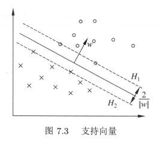

# Support vector machines

## 特征

* 二分类
* 线性分类器
* 核技巧 -> 非线性分类器

## 前置知识

**函数间隔**（functional margin）

由点到平面的公式 $D=\frac{|w\cdot x +b|}{||w||}$ 可知，在超平面 $w\cdot x+b$ 确定的情况下，$|w\cdot x+b|$ 可以**相对**表示点 $x$ 距离超平面的远近。而 $y_i\in\{-1,+1\}$，故可以根据 $y_i(w\cdot x_i + b)$ 的符号判断分类结果的正确性和确信度 。

对于给定的训练数据集 $T$ 和超平面 $(w,b)$，定义超平面 $(w,b)$ 关于样本点 $(x_i,y_i)$ 的函数间隔为：
$$
\hat{\gamma_i}=y_i(w\cdot x_i + b)
$$
定义超平面 $w,b$ 关于训练数据集 $T$ 的函数间隔为超平面 $(w,b)$ 关于 $T$ 中所有样本点 $(x_i,y_i)$ 的函数间隔最小值，即：
$$
\hat{\gamma}=\min_{i=1,\cdots,N}\hat{\gamma_i}
$$
**几何间隔**（geometric margin）

几何间隔将函数间隔规范化，对于给定的训练数据集 $T$ 和超平面 $(w,b)$，定义超平面 $(w,b)$ 关于样本点 $(x_i,y_i)$ 的几何间隔为：
$$
\hat{\gamma_i}=y_i(\frac{w}{||w||}\cdot x_i + \frac{b}{||w||})
$$
定义超平面 $w,b$ 关于训练数据集 $T$ 的几何间隔为超平面 $(w,b)$ 关于 $T$ 中所有样本点 $(x_i,y_i)$ 的函数间隔最小值，即：
$$
{\gamma}=\min_{i=1,\cdots,N}\hat{\gamma_i}
$$
几何间隔和函数间隔的关系为：
$$
\gamma=\frac{\hat\gamma}{||w||}
$$
若 $||w||=1$，则两者相等。若超平面参数 $w$ 和 $b$ 成比例地改变（超平面没有改变），函数间隔会按此比例改变，而几何间隔不会。

**间隔最大化**

求一个几何间隔最大的分离超平面，可以表示为以下约束最优化问题：
$$
\begin{align}
\max_{w,b}\quad&\gamma \\
\mathrm{s.t.}\quad &y_i\left( \frac{w}{||w||}\cdot x_i+\frac{b}{||w||} \right)\geq\gamma,\quad i=1,2,\cdots,N
\end{align}
$$
根据几何间隔与函数间隔的关系，上式等价于：
$$
\begin{align}
\max_{w,b}\quad&\frac{\hat\gamma}{||w||} \\
\mathrm{s.t.}\quad &y_i\left( w\cdot x_i+b \right)\geq\gamma||w||=\hat\gamma,\quad i=1,2,\cdots,N
\end{align}
$$
易知，函数间隔 $\hat{\gamma}$ 的取值影响 $w,b$，但不影响最优化问题的解 $\frac{\hat\gamma}{||w||}$（即 $\gamma$）。故可取 $\hat\gamma=1$，带入上式，并注意到最大化 $\frac{1}{||w||}$ 等价于最小化 $\frac{1}{2}||w||^2$，故得到线性可分支持向量机学习的最优化问题：
$$
\begin{align}
\min_{w,b}\quad &\frac{1}{2}||w||^2 \\
\mathrm{s.t.}\quad &1-y_i(w\cdot x_i+b) \leq 0,\quad i=1,2,\cdots,N
\end{align}
$$
**支持向量**和**间隔边界**

在线性可分的情况下，训练数据集的样本中与分离超平面距离最近的样本点（实例）称为支持向量（support vector），即使下式约束条件等号成立的点：
$$
y_i(w\cdot x_i+b)-1=0
$$
对于 $y_i=+1$ 的正例点，支持向量在超平面 $H_1:w\cdot x+b=1$ 上；对于 $y_i=-1$ 的负例点，支持向量在超平面 $H_1:w\cdot x+b=-1$ 上；如下图所示，在 $H_1$ 和 $H_2$ 上的点就是支持向量。

其中 $H_1$ 和 $H_2$ 相互平行，称为间隔边界，并且没有实例点落在它们中间，分离超平面与它们平行且位于它们中央。$H_1$ 和 $H_2$ 之间的距离称为间隔（margin），等于 $\frac{2}{||w||}$。

在决定分离超平面时，只有支持向量起作用，移动或删除其他实例点不改变解，故支持向量机由很少的“重要的”训练样本确定。

## 模型

### 线性可分支持向量机（Linear support vector machine in linearly separable case）

给定一个特征空间上的训练数据集：
$$
T=\{(x_1,y_1),(x_2,y_2),\cdots,(x_N,y_N)\}
$$
其中 $x_i \in \cal{X} \subseteq{\bf{R}^n}$ 为第 $i$ 个特征向量，也称为实例；$y_i \in \cal{Y} = \{+1,-1\}$ 为实例的类别，当 $y_i=+1$ 时，称 $x_i$ 为正例；当 $y_i=-1$ 时，称 $x_i$ 为负例。$i=1,2,\cdots,N$。

假定训练集线性可分，通过构造并求解约束最优化问题：
$$
\begin{align}
\min_{w,b}\quad &\frac{1}{2}||w||^2 \\
\mathrm{s.t.}\quad &1-y_i(w\cdot x_i+b) \leq 0,\quad i=1,2,\cdots,N
\end{align}
$$
求解得到最优解 $w^*,b^*$，由此得到分离超平面：
$$
w^*\cdot x+b^*=0
$$
相应的分类决策函数为：
$$
f(x)=\mathrm{sign}(w^*\cdot x+ b^*)
$$
称为线性可分支持向量机。

### 线性支持向量机（Linear support vector machine）

### 非线性支持向量机（non-linear support vector machine）

## 策略

## 算法

求解凸二次规划的最优化算法