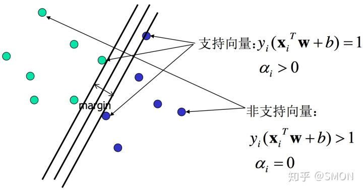

# Support vector machines

## 特征

* 二分类
* 线性分类器
* 核技巧 -> 非线性分类器

## 前置知识

**函数间隔**（functional margin）

由点到平面的公式 $D=\frac{|w\cdot x +b|}{||w||}$ 可知，在超平面 $w\cdot x+b$ 确定的情况下，$|w\cdot x+b|$ 可以**相对**表示点 $x$ 距离超平面的远近。而 $y_i\in\{-1,+1\}$，故可以根据 $y_i(w\cdot x_i + b)$ 的符号判断分类结果的正确性和确信度 。

对于给定的训练数据集 $T$ 和超平面 $(w,b)$，定义超平面 $(w,b)$ 关于样本点 $(x_i,y_i)$ 的函数间隔为：
$$
\hat{\gamma_i}=y_i(w\cdot x_i + b)
$$
定义超平面 $w,b$ 关于训练数据集 $T$ 的函数间隔为超平面 $(w,b)$ 关于 $T$ 中所有样本点 $(x_i,y_i)$ 的函数间隔最小值，即：
$$
\hat{\gamma}=\min_{i=1,\cdots,N}\hat{\gamma_i}
$$
**几何间隔**（geometric margin）

几何间隔将函数间隔规范化，对于给定的训练数据集 $T$ 和超平面 $(w,b)$，定义超平面 $(w,b)$ 关于样本点 $(x_i,y_i)$ 的几何间隔为：
$$
\gamma_i=y_i(\frac{w}{||w||}\cdot x_i + \frac{b}{||w||})
$$
定义超平面 $w,b$ 关于训练数据集 $T$ 的几何间隔为超平面 $(w,b)$ 关于 $T$ 中所有样本点 $(x_i,y_i)$ 的函数间隔最小值，即：
$$
{\gamma}=\min_{i=1,\cdots,N}\gamma_i
$$
几何间隔和函数间隔的关系为：
$$
\gamma=\frac{\hat\gamma}{||w||}
$$
若 $||w||=1$，则两者相等。若超平面参数 $w$ 和 $b$ 成比例地改变（超平面没有改变），函数间隔会按此比例改变，而几何间隔不会。

**间隔最大化**

求一个几何间隔最大的分离超平面，可以表示为以下约束最优化问题：
$$
\begin{align}
\max_{w,b}\quad&\gamma \quad\Longleftrightarrow \quad
\max_{w,b}\min_{i}\quad y_i(\frac{w}{||w||}\cdot x_i + \frac{b}{||w||}) \\
\mathrm{s.t.}\quad &y_i\left( \frac{w}{||w||}\cdot x_i+\frac{b}{||w||} \right)\geq\gamma,\quad i=1,2,\cdots,N
\end{align}
$$
根据几何间隔与函数间隔的关系，上式等价于：
$$
\begin{align}
\max_{w,b}\quad&\frac{\hat\gamma}{||w||} \quad\Longleftrightarrow \quad
\max_{w,b}\min_{i}\quad y_i(\frac{w}{||w||}\cdot x_i + \frac{b}{||w||}) \\
\mathrm{s.t.}\quad &y_i\left( w\cdot x_i+b \right)\geq\gamma||w||=\hat\gamma,\quad i=1,2,\cdots,N
\end{align}
$$
易知，函数间隔 $\hat{\gamma}$ 的取值影响 $w,b$，但不影响最优化问题的解 $\frac{\hat\gamma}{||w||}$（即 $\gamma$）。故可取 $\hat\gamma=1$，即 $\min\limits_{i}\ y_i(w\cdot x_i+b)=1$，带入上式，并注意到最大化 $\frac{1}{||w||}$ 等价于最小化 $\frac{1}{2}||w||^2$，故得到线性可分支持向量机学习的最优化问题：
$$
\begin{align}
\min_{w,b}\quad &\frac{1}{2}||w||^2 \\
\mathrm{s.t.}\quad &1-y_i(w\cdot x_i+b) \leq 0,\quad i=1,2,\cdots,N
\end{align}
$$
**支持向量**和**间隔边界**

在线性可分的情况下，训练数据集的样本中与分离超平面距离最近的样本点（实例）称为支持向量（support vector），即使下式约束条件等号成立的点：
$$
y_i(w\cdot x_i+b)-1=0
$$
对于 $y_i=+1$ 的正例点，支持向量在超平面 $H_1:w\cdot x+b=1$ 上；对于 $y_i=-1$ 的负例点，支持向量在超平面 $H_1:w\cdot x+b=-1$ 上；如下图所示，在 $H_1$ 和 $H_2$ 上的点就是支持向量。

[图片来源](https://zhuanlan.zhihu.com/p/49331510)

其中 $H_1$ 和 $H_2$ 相互平行，称为间隔边界，并且没有实例点落在它们中间，分离超平面与它们平行且位于它们中央。$H_1$ 和 $H_2$ 之间的距离称为间隔（margin），等于 $\frac{2}{||w||}$。

在决定分离超平面时，只有支持向量起作用，移动或删除其他实例点不改变解，故支持向量机由很少的“重要的”训练样本确定。

## 模型

### 线性可分支持向量机（Linear support vector machine in linearly separable case）

给定一个特征空间上的训练数据集：
$$
T=\{(x_1,y_1),(x_2,y_2),\cdots,(x_N,y_N)\}
$$
其中 $x_i \in \cal{X} \subseteq{\bf{R}^n}$ 为第 $i$ 个特征向量，也称为实例；$y_i \in \cal{Y} = \{+1,-1\}$ 为实例的类别，当 $y_i=+1$ 时，称 $x_i$ 为正例；当 $y_i=-1$ 时，称 $x_i$ 为负例。$i=1,2,\cdots,N$。

假定训练集线性可分，通过构造并求解约束最优化问题：
$$
\begin{align}
\min_{w,b}\quad &\frac{1}{2}||w||^2 \\
\mathrm{s.t.}\quad &1-y_i(w\cdot x_i+b) \leq 0,\quad i=1,2,\cdots,N
\end{align}
$$
求解得到最优解 $w^*,b^*$，由此得到分离超平面：
$$
w^*\cdot x+b^*=0
$$
相应的分类决策函数为：
$$
f(x)=\mathrm{sign}(w^*\cdot x+ b^*)
$$
称为线性可分支持向量机。

**对偶问题**

定义拉格朗日函数：
$$
\begin{align}
L(w,b,a)&=\frac{1}{2}||w||^2+\sum_{i=1}^N a_i[1-y_i(w\cdot x_i+b)]\\
&=\frac{1}{2}||w||^2+\sum_{i=1}^{N}a_i-\sum_{i=1}^N a_iy_i(w\cdot x_i+b)
\end{align}
$$
其中，$a=(a_1,a_2,\cdots,a_N)^T$ 为拉格朗日乘子向量，$a_i>0$。原问题为：
$$
\min_{w,b}\max_{a}L(w,b,a)
$$
对偶问题为：
$$
\max_{a}\min_{w,b}L(w,b,a)
$$
求解过程：

1. 求 $\min_\limits{w,b}L(w,b,a)$。将 $L(w,b,a)$ 分别对 $w,b,a$ 求偏导并令其等于 0：
   $$
   \begin{align}
   &\begin{cases}
   &\nabla_{w}L(w,b,a)=w-\sum_{i=1}^Na_iy_ix_i=0\\
   &\nabla_{b}L(w,b,a)=-\sum_{i=1}^Na_iy_i=0
   \end{cases}
   \\
   \Rightarrow&\begin{cases}
   &w=\sum_{i=1}^Na_iy_ix_i\\
   &\sum_{i=1}^Na_iy_i=0
   \end{cases}
   \end{align}
   $$
   代入 $L(w,b,a)$ 得：
   $$
   \begin{align}L(w,b,a)
   &=\frac{1}{2}\sum_{i=1}^N\sum_{j=1}^N[(a_i y_i x_i)^T(a_j y_j x_j)]
   +\sum_{i=1}^Na_i-b\sum_{i=1}^Na_iy_i-\sum_{i=1}^N\sum_{j=1}^N[(a_i y_i x_i)^T(a_j y_j x_j)\\
   &=-\frac{1}{2}\sum_{i=1}^N\sum_{j=1}^N a_ia_j y_iy_j (x_i\cdot x_j)+\sum_{i=1}^Na_i
   \end{align}
   $$
   即：
   $$
   \min_{w,b}L(w,b,a)=-\frac{1}{2}\sum_{i=1}^N\sum_{j=1}^N a_ia_j y_iy_j(x_i\cdot x_j)+\sum_{i=1}^Na_i
   $$

2. 求 $\max\limits_{a}\min\limits_{w,b}L(w,b,a)$。将上式反号，变为 $\min\limits_{a}[-\min\limits_{w,b}L(w,b,a)]$ 得：
   $$
   \begin{align}
   \min_a \quad& \frac{1}{2}\sum_{i=1}^N\sum_{j=1}^N a_ia_j y_iy_j (x_i\cdot x_j)-\sum_{i=1}^Na_i\\
   \mathrm{s.t.} \quad& \sum_{i=1}^Na_iy_i=0\\
   & a_i\geq0,\quad i=1,2,\cdots,N
   \end{align}
   $$

3. 设上式的解为 $a^*=(a_1^*,a_2^*,\cdots,a_l^*)$，有以下定理：

   **定理** 设 $a^*=(a_1^*,a_2^*,\cdots,a_l^*)^T$ 是上式的解，则存在下标 $j$，使得 $a_j^*>0$，并且可按下式求得原始最优化问题的解 $w^*,\ b^*$：
   $$
   w^*=\sum_{i=1}^N a_i^* y_i x_i\\
   b^*=y_j-\sum_{i=1}^N a_i^*y_i(x_i\cdot x_j)
   $$
   

输入：线性可分训练集 $T=\{(x_1,y_1),(x_2,y_2),\cdots,(x_N,y_N)\}$，其中 $x_i\in\mathcal{X}\sube \R^n$，$\ y_i\in\mathcal{Y}=\{-1,+1\}$，$\ i=1,2,\cdots,N$

输出：分离超平面和分类决策函数。

构造并求解最优化问题：
$$
\begin{align}
\min_a \quad& \frac{1}{2}\sum_{i=1}^N\sum_{j=1}^N a_ia_j y_iy_j (x_i\cdot x_j)-\sum_{i=1}^Na_i\\
\mathrm{s.t.} \quad& \sum_{i=1}^Na_iy_i=0\\
& a_i\geq0,\quad i=1,2,\cdots,N
\end{align}
$$
得最优解为 $a^*=(a_1^*,a_2^*,\cdots,a_l^*)$。

计算：
$$
w^*=\sum_{i=1}^N a_i^* y_i x_i
$$
选择 $a^*$ 的一个正分量 $a_j^*>0$，计算：
$$
b^*=y_j-\sum_{i=1}^N a_i^*y_i(x_i\cdot x_j)
$$
求得分离超平面：
$$
w^*+b=0
$$
相应的分类决策函数：
$$
f(x)=\mathrm{sign}(w^*\cdot x+ b^*)
$$
**支持向量**

由于 $w^*$ 和 $b^*$ 只依赖于训练数据中 $a_i^*>0$ 的样本点 $(x_i,y_i)$，故将这些实例点称为支持向量。 

### 线性支持向量机（Linear support vector machine）

若训练集大部分线性可分，但存在少数特异点（outlier）使得整个数据集不再线性可分，原算法无解。故可允许 SVM 在少量样本上出错，引入**软间隔**（soft margin）的概念，即部分点不能满足函数间隔大于等于 1 的约束条件，则对每个样本点（$x_i,y_i$），引入**松弛变量** $\xi_i\geq0$，使函数间隔加上松弛变量大于等于 1，即：
$$
y_i(w\cdot x_i+b)\geq1-\xi_i
$$
为了使不满足条件的点尽可能少，应对目标函数进行惩罚，即：
$$
\frac{1}{2}||w||^2+C\sum_{i=1}^N\xi_i
$$
其中 $C>0$ 为惩罚系数，越大则对误分类的惩罚越大，反之则惩罚越小。则线性支持向量机的学习问题变为如下凸二次规划（convex quadratic programming）问题：
$$
\begin{align}
\min_{w,b,\ \xi}\quad &\frac{1}{2}||w||^2+C\sum_{i=1}^N\xi_i\\
\mathrm{s.t.}\quad &y_i(w\cdot x_i+b)\geq1-\xi_i,\quad i=1,2,\cdots,N\\
&\xi_i\geq0,\quad i=1,2,\cdots,N
\end{align}
$$
关于 $(w,b,\xi)$ 的解是存在的，可以证明 $w$ 的解释唯一的，但 $b$ 的解可能不唯一，而是存在一个区间。设解为 $(w^*,\ b^*)$，则分离超平面为：
$$
w^*\cdot x+b=0
$$
相应的分类决策函数为：
$$
f(x)=\mathrm{sign}(w^*\cdot x+b^*)
$$
**对偶问题**

原始最优化问题的拉格朗日函数：
$$
L(w,b,\xi,a,\mu)\equiv \frac{1}{2}||w||^2+C\sum_{i=1}^N\xi_i-\sum_{i=1}^Na_i[y_i(w\cdot x_i+b)-1+\xi_i]-\sum_{i=1}^N\mu_i\xi_i
$$
其中 $a_i\geq0,\ \mu_i\geq0$。

### 非线性支持向量机（non-linear support vector machine）

## 策略

## 算法

求解凸二次规划的最优化算法