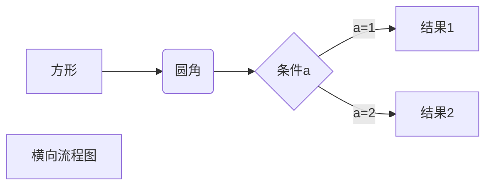
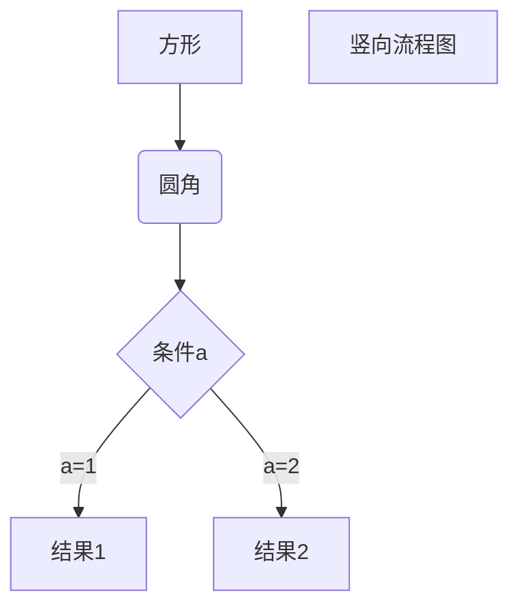

# Markdown Cheat Sheet
[TOC]

## 前言

修改自 [smirkcao](https://github.com/SmirkCao/Lihang`) 的 math_markdown.md

## 数学符号

### 表 1: 数学模式重音符

| 示例 | 代码 | 示例 | 代码 | 示例 | 代码 | 示例 | 代码 |
| - | - | - | - | - | - | - | - |
| $\hat {a}$ | **\hat{a}** | $\check{a}$ | **\check{a}** | $\tilde{a}$ | **\tilde{a}** | $\acute{a}$ | **\acute{a}** |
| $\grave{a}$ | **\grave{a}** | $\dot {a}$    | **\dot{a}** | **$\bar{a}$ **  | **\bar{a}** | $\ddot a$ | **\ddot{a}**  |
| $\vec {a}$  | **\vec{a}** | $\widehat{A}$ | **\widehat{A}** | $\widetilde{A}$ | **\widetilde{A}** | $\breve a$  | **\breve{a}** |
| $\hat{A}$ | **\hat{A}** | $\tilde{A}$   | **\tilde{A}**   |                 |                   |  |  |

### 表 2: 小写希腊字母

|示例|代码|示例|代码|示例|代码|示例|代码|
|-|-|-|-|-|-|-|-|
| $\alpha$ | \alpha | $\theta$ | **\theta** | $\upsilon$ | **\upsilon** | $o $ | **o** |
| $\beta$ | **\beta** | $\vartheta$ | **\vartheta** | $\pi$ | **\pi** | $\phi$   | **\phi** |
| $\gamma$ | **\gamma** | $\iota$ | **\iota** | $\varpi$ | **\varpi** | $\varphi$ | **\varphi** |
| $\delta$ | **\delta** | $\kappa$ | **\kappa** | $\rho$ | **\rho** | $\chi$ | **\chi** |
| $\epsilon$ | **\epsilon** | $\lambda$ | **\lambda** | $\varrho$ | **\varrho** | $\psi$ | **\psi** |
| $\varepsilon$ | **\varepsilon** | $\mu$ | **\mu** | $\sigma$ | **\sigma** | $\omega$ | **\omega** |
| $\zeta$ | **\zeta** | $\nu$ | **\nu** | $\varsigma$ | **\varsigma** | $\nabla$ | **\nabla** |
| $\eta$ | **\eta** | $\xi$ | **\xi** | $\tau$ | **\tau** | $\partial$ | **\partial** |

### 表 3: 大写希腊字母

| 示例 |代码 |示例|代码|示例|代码|示例|代码|
| - | - | - | - | - | - | - | - |
| $\Gamma$ | **\Gamma** | $\Lambda$ | **\Lambda** | $\Sigma\mit\Sigma$ | **\Sigma\mit\Sigma** | $\Psi$ | **\Psi** |
| $\Delta$ | **\Delta** |$\Xi$ | **\Xi** | $\Upsilon$ | **\Upsilon** | $\Omega\mit\Omega$ | **\Omega\mit\Omega** |
| $\Theta$ | **\Theta** | $\Pi$ | **\Pi** | $\Phi$ | **\Phi** |  | |

### 表 4: 数学字母

| 示例 | 代码 |
| - | - |
| $\mathbf {ABCdefxyzXYZ123}$ | \mathbf {ABCdefxyzXYZ123} |
| $\mathrm {ABCdefxyzXYZ123}$ | \mathrm {ABCdefxyzXYZ123} |
| $\mathit {ABCdefxyzXYZ123}$ | \mathit {ABCdefxyzXYZ123} |
| $\mathcal {ABCdefxyzXYZ123}$ | \mathcal {ABCdefxyzXYZ123} |
| $\mathscr {ABCdefxyzXYZ123}$ | \mathscr {ABCdefxyzXYZ123} |
| $\mathfrak {ABCdefxyzXYZ123}$ | \mathfrak {ABCdefxyzXYZ123} |
| $\mathbb {ABCdefxyzXYZ123}$ | \mathbb {ABCdefxyzXYZ123} |
| $\boldsymbol{ABCdefxyzXYZ123}$ | \boldsymbol{ABCdefxyzXYZ123} |

### 表 5: 运算符与函数

| 示例 | 代码 | 示例 | 代码 | 示例 | 代码 |
| - | - | - | - | - | - |
| $\sum$ | \sum | $\prod$ | \prod | $x\cdot{y}$ | x\cdot{y} |
| $\bigcup$ | \bigcup | $\bigoplus$ | \bigoplus | $x\times {y}$ | x\times {y} |
| $\bigvee$ | \bigvee | $\bigcap$ | \bigcap| $\left\|w\right\|$ | **\left\\|
| $\bigwedge$ | \bigwedge  | $\biguplus$ | \biguplus | $\iiint$ | \iiint |
| $\bigotimes$ | \bigotimes | $\oint$ | \oint | $\iint$ | \iint |
| $\int x\,{\rm d}x$ | \int x\,\{\rm d}x | $\bigsqcup$ | \bigsqcup | $\lgroup \rgroup$ | \lgroup \rgroup |
| $\coprod$ | \coprod | $\bigodot$ | \bigodot  | $\partial$ | \partial |
| $\det$ | \det | $\max$ | \max | $\min$ | \min |
| $\log$ | \log | $\mathrm{d}x$ | \mathrm{d}x |  |  |

### 表 6: 常用箭头

| 示例 | 代码 | 示例 | 代码 | 示例 | 代码 |
| - | - | - | - | - | - |
| $\leftarrow$ | \leftarrow | $\rightarrow$ | \rightarrow | $\leftrightarrow$ | \leftrightarrow |
| $\longleftarrow$ | \longleftarrow | $\longrightarrow$ | \longrightarrow | $\longleftrightarrow$  | \longleftrightarrow |
| $\Leftarrow$ | \Leftarrow | $\Rightarrow$ | \Rightarrow | $\Leftrightarrow$ | \Leftrightarrow |
| $\Longleftarrow$ | \Longleftarrow | $\Longrightarrow$ | \Longrightarrow | $\Longleftrightarrow$ | \Longleftrightarrow |
| $\uparrow$ | \uparrow | $\downarrow$ | \downarrow | $\updownarrow$ | \updownarrow |

### 表 7: 集合符

| 示例           | 代码         | 示例          | 代码        | 示例                | 代码    |
| -------------- | ------------ | ------------- | ----------- | ------------------- | ------- |
| $\leqslant$    | \leqslant    | $\geqslant$   | \geqslant   | $\cal {C} \equiv 1$ | \equiv  |
| $\thickapprox$ | \thickapprox | $\leq$        | \leq        | $\geq$              | \geq    |
| $\neq$         | \neq         | $\in$         | \in         | $\hat{=}$           | \hat{=} |
| $\subset$      | \subset      | $\subseteq$   | \subseteq   | $\supset$           | \supset |
| $\supseteq$    | \supseteq    | $\gg$         | \gg         | $\ll$               | \ll     |
| $\empty$       | \empty       | $\varnothing$ | \varnothing |                     |         |
|                |              |               |             |                     |         |

### 表8: 关系符号

| 示例             | 代码           | 示例       | 代码     | 示例      | 代码    |
| ---------------- | -------------- | ---------- | -------- | --------- | ------- |
| $\therefore$     | \therefore     | $\because$ | \because | $\forall$ | \forall |
| $\thicksim \sim$ | \thicksim \sim | $\exist$   | \exist   | $\neg$    | \neg    |
| $\and$           | \and           | $\or$      | \or      | $\oplus$  | \oplus  |

### 表 9: 其他常用符号

| 示例 | 代码 | 示例 | 代码 | 示例 | 代码 |
| - | - | - | - | - | - |
| $\sqrt{a}$ | \sqrt{a} | $g^\prime$   | g^\prime   | $\min \limits_{f \in {H}}$ | \min \limits_{f \in {H}} |
| $\infty$     | \infty     | $\varpropto$ | \varpropto | $\angle$                   | \angle                   |
| $\perp $   | \perp    | $\lceil$     | \lceil     | $\rceil$                   | \rceil                   |
| $\pm$      | \pm      | $\bot$           | \bot       | $\top$                     | \top                 |
| $\lfloor$  | \lfloor  | $\rfloor$    | \rfloor    | $\circ$                    | \circ                    |
| $\cdots$   | \cdots   | $\vdots$     | \vdots     | $\ddots$                   | \ddots                   |
| $\ldots$   | \ldots=… | $\LaTeX$ | \LaTeX | $\|$ | \| |
| $\langle$ | \langle | $\rangle$ | \rangle |  |  |

注意\bot和\perp的区别，垂直是\perp

### 表 10: 使用字体

| 示例 | 代码 | 备注 |
| - | - | - |
| $\rm {ABCdefxyzXYZ123}$ | \rm {ABCdefXYZ123} | 罗马体 |
| $\it{ABCdefxyzXYZ123}$ | \it{ABCdefXYZ123} | 意大利体 |
| $\bf{ABCdefxyzXYZ123}$ | \bf{ABCdefXYZ123} | 正粗体，黑体 |
| $\cal {ABCdefxyzXYZ123}$ | \cal {ABCdefXYZ123} | 花体 |
| $\sf{ABCdefXYZ123}$ | \sf{ABCdefXYZ123} | 等线体 |
| $\mit{ABCdefxyzXYZ123}$ | \mit{ABCdefXYZ123} | 数字斜体 |
| $\tt{ABCdefxyzXYZ123}$ | \tt{ABCdefXYZ123} | 打印机字体 |

### 表 11: 空格与间隔

| 说明         | 代码       | 示例         | 备注           |
| ------------ | ---------- | ------------ | -------------- |
| quad空格     | a \quad b  | $a \quad b$  | 一个*m*的宽度  |
| 两个quad空格 | a \qquad b | $a \qquad b$ | 两个*m*的宽度  |
| 大空格       | a\ b       | $a\ b$       | 1/3*m*宽度     |
| 中等空格     | a\;b       | $a\;b$       | 2/7*m*宽度     |
| 小空格       | a\,b       | $a\,b$       | 1/6*m*宽度     |
| 没有空格     | ab         | $ab$         |                |
| 紧贴         | a\!b       | $a\!b$       | 缩进1/6*m*宽度 |

\quad、1em、em、m代表当前字体下接近字符‘M’的宽度。

## 其他表达

### 表 A: 分段函数与公式对齐

#### 分段函数

示例
$$
f(x,y) = \begin{cases}
1 & x与y满足某一事实\\
0 & 否则
\end{cases}
$$

```latex
# 代码
f(x,y) = \begin{cases}
1 & x与y满足某一事实\\
0 & 否则
\end{cases}
```

$$
\begin{aligned}
L(w)&=\sum\limits^{N}_{i=1}[y_i\log\pi(x_i)+(1-y_i)\log(1-\pi(x_i))]\\&=\sum\limits^{N}_{i=1}[y_i\log{\frac{\pi(x_i)}{1-\pi(x_i)}}+\log(1-\pi(x_i))]\\&=\sum\limits^{N}_{i=1}[y_i(w\cdot x_i)-\log(1+\exp(w\cdot{x_i})]
\end{aligned}
$$

#### 对齐控制

```latex
# 代码
# 通过\begin{aligned}\end{aligned}控制对齐, 使用&表示对齐点.
\begin{aligned}
L(w)&=\sum\limits^{N}_{i=1}[y_i\log\pi(x_i)+(1-y_i)\log(1-\pi(x_i))]\\
&=\sum\limits^{N}_{i=1}[y_i\log{\frac{\pi(x_i)}{1-\pi(x_i)}}+\log(1-\pi(x_i))]\\
&=\sum\limits^{N}_{i=1}[y_i(w\cdot x_i)-\log(1+\exp(w\cdot{x_i})]
\end{aligned}
```

另外注意到前面的分段函数自动变好了，但是上面多行对齐的公式没有自动编号，如果需要**自动**编号，外面嵌入equation
$$
\begin{equation}
\begin{aligned}
L(w)&=\sum\limits^{N}_{i=1}[y_i\log\pi(x_i)+(1-y_i)\log(1-\pi(x_i))]\\
&=\sum\limits^{N}_{i=1}[y_i\log{\frac{\pi(x_i)}{1-\pi(x_i)}}+\log(1-\pi(x_i))]\\
&=\sum\limits^{N}_{i=1}[y_i(w\cdot x_i)-\log(1+\exp(w\cdot{x_i})]
\end{aligned}
\end{equation}
$$
代码如下

```latex
\begin{equation}
\begin{align}
L(w)&=\sum\limits^{N}_{i=1}[y_i\log\pi(x_i)+(1-y_i)\log(1-\pi(x_i))]\\&=\sum\limits^{N}_{i=1}[y_i\log{\frac{\pi(x_i)}{1-\pi(x_i)}}+\log(1-\pi(x_i))]\\&=\sum\limits^{N}_{i=1}[y_i(w\cdot x_i)-\log(1+\exp(w\cdot{x_i})]
\end{align}
\end{equation}
```

#### 公式编号

关于编号也可以通过行间公式做如下表达
$$
\begin{align}
L(w)&=\sum\limits^{N}_{i=1}[y_i\log\pi(x_i)+(1-y_i)\log(1-\pi(x_i))]\\
&=\sum\limits^{N}_{i=1}[y_i\log{\frac{\pi(x_i)}{1-\pi(x_i)}}+\log(1-\pi(x_i))]\nonumber\\
&=\sum\limits^{N}_{i=1}[y_i(w\cdot x_i)-\log(1+\exp(w\cdot{x_i})]
\end{align}
$$
代码如下

```latex
\begin{align}
L(w)&=\sum\limits^{N}_{i=1}[y_i\log\pi(x_i)+(1-y_i)\log(1-\pi(x_i))]\\
&=\sum\limits^{N}_{i=1}[y_i\log{\frac{\pi(x_i)}{1-\pi(x_i)}}+\log(1-\pi(x_i))]\nonumber\\
&=\sum\limits^{N}_{i=1}[y_i(w\cdot x_i)-\log(1+\exp(w\cdot{x_i})]
\end{align}
```

以上代码有两点需要注意体会：

1. align
1. \nonumber的使用

### 表B:排版控制

#### 符号大小

| 示例                                                         | 备注                                                         |
| ------------------------------------------------------------ | ------------------------------------------------------------ |
| $\left \{ \frac{3}{5}  \left [ 3 + 2 * \left ( a + b +（-0.5）\right ) \right ] \right \}$ | \left \right 配对使用，自动控制不同层次括号的大小，大小依据具体公式变化。（可能大小不变） |
| $\bigg \{ \frac{3}{5}  \Big [ 3 + 2 * \big ( a + b + （-0.5） \big ) \Big ] \bigg \}$ | \big，\Big，\bigg，\Bigg，按顺序控制的括号不断变大，且大小相对固定。（大小必变） |
| $\big( \Big( \bigg( \Bigg($                                  | \big( \Big( \bigg( \Bigg(                                    |
| $\big[ \Big[ \bigg[ \Bigg[$                                  | \big[ \Big[ \bigg[ \Bigg[                                    |
| $\big\{ \Big\{ \bigg\{ \Bigg\{$                              | \big\{ \Big\{ \bigg\{ \Bigg\{                                |
| $\big \langle \Big \langle \bigg \langle \Bigg \langle$      | \big \langle \Big \langle \bigg \langle \Bigg \langle        |
| $\big| \Big| \bigg| \Bigg|$                                  | $\big\| \Big\| \bigg\| \Bigg\|$                              |
| $\big \lceil \Big \lceil \bigg \lceil \Bigg \lceil$          | \big \lceil \Big \lceil \bigg \lceil \Bigg \lceil            |
| $\big \rfloor \Big \rfloor \bigg \rfloor \Bigg \rfloor$      | \big \rfloor \Big \rfloor \bigg \rfloor \Bigg \rfloor        |

#### 上下标位置

| 示例                       | 备注                                               |
| -------------------------- | -------------------------------------------------- |
| $\min_{f \in {H}}$         | \min_{f \in {H}} 一般情况 inline math 会被压缩位置 |
| $\min \limits_{f \in {H}}$ | \min \limits_{f \in {H}} 强制使下标在正下方        |

### 表C: 矩阵

#### 普通矩阵

| Type                            | $\LaTeX$ markup                                              | Renders as                                         |
| ------------------------------- | ------------------------------------------------------------ | -------------------------------------------------- |
| Plain                           | \begin{matrix}<br/>1 & 2 & 3\\<br/>a & b & c<br/>\end{matrix} | $\begin{matrix}1 & 2 & 3\\a & b & c\end{matrix}$   |
| Parentheses;<br/>round brackets | \begin{pmatrix}<br/>1 & 2 & 3\\<br/>a & b & c<br/>\end{pmatrix} | $\begin{pmatrix}1 & 2 & 3\\a & b & c\end{pmatrix}$ |
| Brackets;<br/>square brackets   | \begin{bmatrix}<br/>1 & 2 & 3\\<br/>a & b & c<br/>\end{bmatrix} | $\begin{bmatrix}1 & 2 & 3\\a & b & c\end{bmatrix}$ |
| Braces;<br/>curly brackets      | \begin{Bmatrix}<br/>1 & 2 & 3\\<br/>a & b & c<br/>\end{Bmatrix} | $\begin{Bmatrix}1 & 2 & 3\\a & b & c\end{Bmatrix}$ |
| Pipes                           | \begin{vmatrix}<br/>1 & 2 & 3\\<br/>a & b & c<br/>\end{vmatrix} | $\begin{vmatrix}1 & 2 & 3\\a & b & c\end{vmatrix}$ |
| Double pipes                    | \begin{Vmatrix}<br/>1 & 2 & 3\\<br/>a & b & c<br/>\end{Vmatrix} | $\begin{Vmatrix}1 & 2 & 3\\a & b & c\end{Vmatrix}$ |

If you need to create matrices with different [delimiters](https://www.overleaf.com/learn/Brackets_and_Parentheses), you can add them manually to a plain `matrix`. For example:

| $\LaTeX$ makeup                                              | Renders as                                                   |
| ------------------------------------------------------------ | ------------------------------------------------------------ |
| \left\lceil<br/>\begin{matrix}<br/>1 & 2 & 3\\<br/>a & b & c<br/>\end{matrix}<br/>\right\rceil | $\left\lceil\begin{matrix}1 & 2 & 3\\a & b & c\end{matrix}\right\rceil$ |

#### 带省略符号的Matrix

$$
X^\mathrm T=
\left[
\begin{matrix}
 x_{11} & \cdots & x_{1N}       \\
 \vdots & \ddots & \vdots 		\\
 x_{M1} & \cdots & x_{MN}       \\
\end{matrix}
\right]
$$

```latex
% 这里稍微注意下转置符号， 《统计学习方法》中的转置用的是正体的T
% 可以参考 https://zhuanlan.zhihu.com/p/27490955 中关于转置写法的讨论。
X^\mathrm T=
\left[
\begin{matrix}
 x_{11} & \cdots & x_{1N}       \\
 \vdots & \ddots & \vdots 		\\
 x_{M1} & \cdots & x_{MN}       \\
\end{matrix}
\right]
```

#### 向量

$$
\left[
\begin{array}
\\2
\\3
\end{array}
\right]
$$

```latex
\left[
\begin{array}
\\2
\\3
\end{array}
\right]
```


$$
\overbrace{abcde}\underbrace{fghij}_{comment}\overline{klmn}\underline{opqr}\overleftarrow{stuv}\overrightarrow{wxyz}
$$

```tex
\overbrace{abcde}\underbrace{fghij}_{comment}\overline{klmn}\underline{opqr}\overleftarrow{stuv}\overrightarrow{wxyz}
```

### 表D: Emoji

| :smirk: smirk          | :smile:smile | :laughing:laughing | :blush:blush       | :smiley:smiley | :heart_eyes:heart_eyes |
| ---------------------- | ------------ | ------------------ | ------------------ | -------------- | ---------------------- |
| 😘kissing_heart         | :wink:wink   | :kissing:kissing   | :confused:confused | :sweat:sweat   | :joy:joy               |
| :sob:sob               | :cry:cry     | :angry:angry       | :yum:yum           | :mask:mask     | :sunglasses:sunglasses |
| :heartpulse:heartpulse | :alien:alien | :cupid:cupid       | :+1:+1             | :cn:cn         | :shit:shit             |

### 表E: 画图

这些复杂图形的绘制都是使用代码块实现的，指定代码块的解析语言，按照响应的绘制语法即可实现。

- 流程图——指定 `mermaid`（样式流程图） 或 `flow` （标准流程图）解析语言
- 时序图——指定 `sequence`（标准时序图） 或 `mermaid`（样式时序图） 解析语言
- 甘特图——指定 `mermaid` 解析语言

#### 一、流程图

##### 1. 样式流程图

基本语法：

- `graph` 指定流程图方向：`graph LR` 横向，`graph TD`  或 `graph TB` 纵向

- 元素的形状定义：

  - `id[描述]` 以直角矩形绘制

  - `id(描述)` 以圆角矩形绘制

  - `id{描述}` 以菱形绘制

  - `id>描述]` 以不对称矩形绘制

  - `id((描述))` 以圆形绘制

    ```mermaid
    graph TD
    A
    B[Bname]
    C(Cname)
    D((Dname))
    E>Ename]
    F{Fname}
    ```

- 线条定义：

  - `A-->B` 带箭头指向
  - `A---B` 不带箭头连接
  - `A-.-B` 虚线连接
  - `A-.->B` 虚线指向
  - `A==>B` 加粗箭头指向
  - `A--描述---B` 不带箭头指向并在线段中间添加描述
  - `A--描述-->B` 带描述的箭头指向
  - `A-.描述.->B` 带描述的虚线连指向
  - `A==描述==>B` 带描述的加粗箭头指向

- 子流程图定义：

  ```
  subgraph title
      graph direction
  end
  ```

示例：





##### 2. 标准流程图

基本语法：

- 定义模块 `id=>关键字: 描述` （“描述”的前面必须有空格，“=>” 两端不能有空格）
- 关键字：
  - `start` 流程开始，以圆角矩形绘制
  - `opearation` 操作，以直角矩形绘制
  - `condition` 判断，以菱形绘制
  - `subroutine` 子流程，以左右带空白框的矩形绘制
  - `inputoutput` 输入输出，以平行四边形绘制
  - `end` 流程结束，以圆角矩形绘制
- 定义模块间的流向：
  - `模块1 id->模块2 id` ：一般的箭头指向
  - `条件模块id (描述)->模块id(direction)` ：条件模块跳转到对应的执行模块，并指定对应分支的布局方向

示例：

```flow
st=>start: 开始框
op=>operation: 处理框
cond=>condition: 判断框(是或否?)
sub1=>subroutine: 子流程
io=>inputoutput: 输入输出框
e=>end: 结束框
st->op->cond
cond(yes)->io->e
cond(no)->sub1(right)->op
```


## Refs

1. [Markdown 数学符号速查](https://www.cnblogs.com/blog4ljy/p/9066624.html)
2. [Cmd Markdown公式指导手册](https://www.zybuluo.com/codeep/note/163962)
3. [Equals_Sign](https://en.wikipedia.org/wiki/Equals_sign#Other_related_symbols)
4. [Emoji](https://gist.github.com/rxaviers/7360908)
5. [Short Math Guide for LaTeX](http://ctan.math.utah.edu/ctan/tex-archive/info/short-math-guide/short-math-guide.pdf)
6. [List of Mathematical Symbols](https://en.wikipedia.org/wiki/List_of_mathematical_symbols)
7. [数学公式](https://zh.wikipedia.org/wiki/Help:数学公式)
8. [Matplotlib Math Text](https://matplotlib.org/tutorials/text/mathtext.html)
9. [SmirkCao, Lihang, (2018), GitHub repository](https://github.com/SmirkCao/Lihang)

